# Integrantes

- Eduardo Célio Freire Lopes - 2120351
- Luiz Roberto Chaves De Tillio - 2418598
- Sara Pessoa Silva - 2120371
# Análise dos testes de carga (Trabalho 3)

Este documento organiza os gráficos gerados em [`graficos/`](graficos/) a partir de [`clean_results.csv`](clean_results.csv): para cada fatia de cenário, o **tempo de resposta (P95)** aparece ao lado da **taxa de falhas**.

## Contexto experimental

| Dimensão | Valores |
|----------|---------|
| **Cenários de tráfego** | **low** — GET de imagem ~300 KB; **medium** — página com texto pesado (~500 KB no nome da requisição); **high** — imagem ~2 MB; **hybrid** — cada iteração percorre os três tipos (`locustfile.py`). |
| **Usuários simultâneos** | 300, 650 e 1000 |
| **Instâncias WordPress** | 1, 2 e 3 (balanceadas pelo Nginx) |
| **Métricas nos gráficos** | P95 convertido para segundos; taxa de falhas = `failures / requests × 100` |

Os detalhes brutos por execução estão nos arquivos `results/<cenário>_<usuários>_inst<n>_stats.csv` (links na [seção final](#arquivos-statscsv)).

---

## Por tipo de carga (Estilos 1 e 2)

Cada linha coloca **tempo de resposta** e **taxa de falhas** para o mesmo recorte de cenário (**low**, **medium**, **high**, **hybrid**), sempre com barras por número de **instâncias** no eixo de agrupamento.

### Carga leve (`low`)

<table>
<tr>
<td align="center"><strong>Tempo de resposta (P95)</strong></td>
<td align="center"><strong>Taxa de falhas (%)</strong></td>
</tr>
<tr>
<td>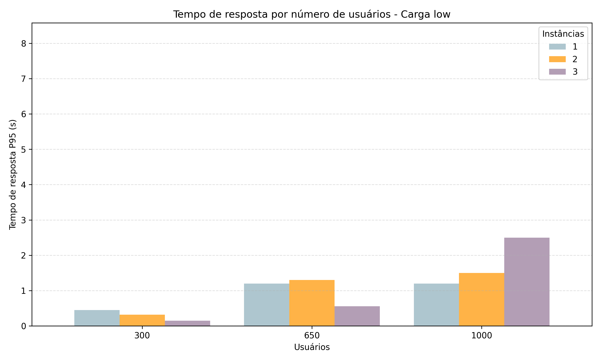</td>
<td></td>
</tr>
</table>

Com payloads pequenos, o sistema permanece estável: na base agregada não há falhas e o P95 permanece na casa de subsegundos a poucos segundos. Escalar para 2–3 instâncias tende a reduzir o P95 nos patamares mais baixos de usuários; em 1000 usuários o comportamento entre 1 e 3 instâncias pode cruzar (efeitos de balanceamento, cache e dispersão da carga), visível na comparação das barras no gráfico.

---

### Carga média (`medium`)

<table>
<tr>
<td align="center"><strong>Tempo de resposta (P95)</strong></td>
<td align="center"><strong>Taxa de falhas (%)</strong></td>
</tr>
<tr>
<td>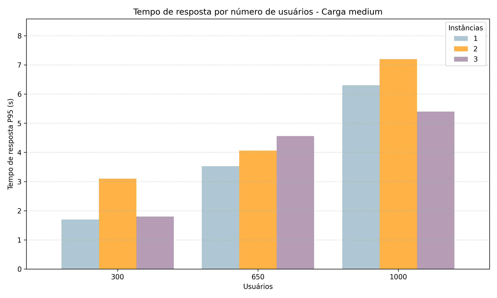</td>
<td>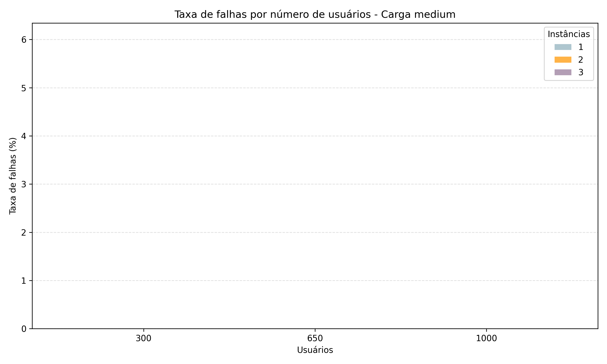</td>
</tr>
</table>

Páginas/texto maior elevam o P95 em relação ao `low`, especialmente com mais usuários concorrentes. Ainda assim, nos dados consolidados as falhas ficam em zero — o gargalo manifesta-se sobretudo como **latência**, não como erro HTTP massivo. Nem sempre “mais instâncias” produz o menor P95 em todos os pontos (filas, contenção no backend compartilhado e variância de execução explicam barras mais altas em algumas combinações).

---

### Carga alta (`high`)

<table>
<tr>
<td align="center"><strong>Tempo de resposta (P95)</strong></td>
<td align="center"><strong>Taxa de falhas (%)</strong></td>
</tr>
<tr>
<td>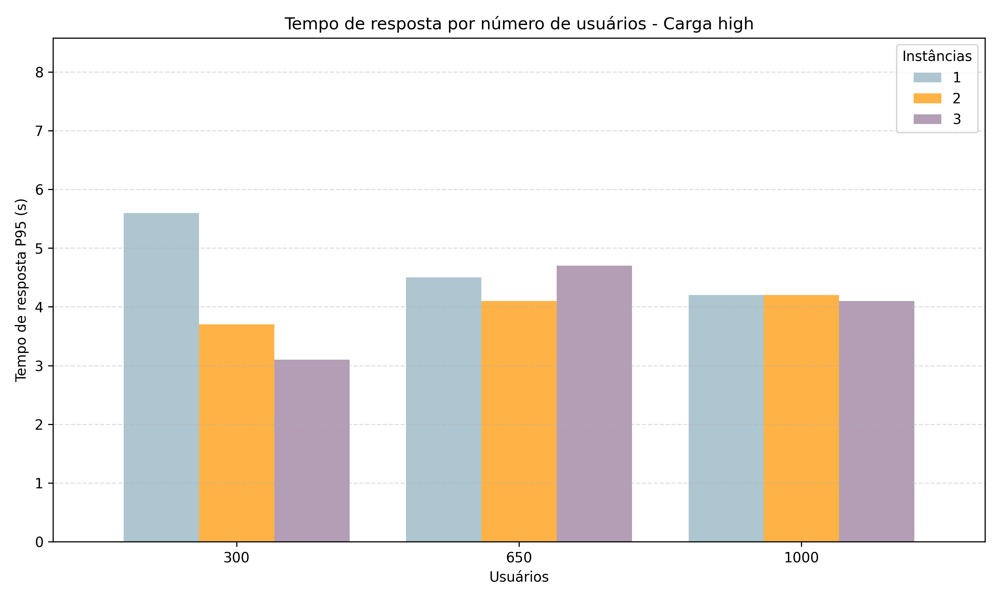</td>
<td>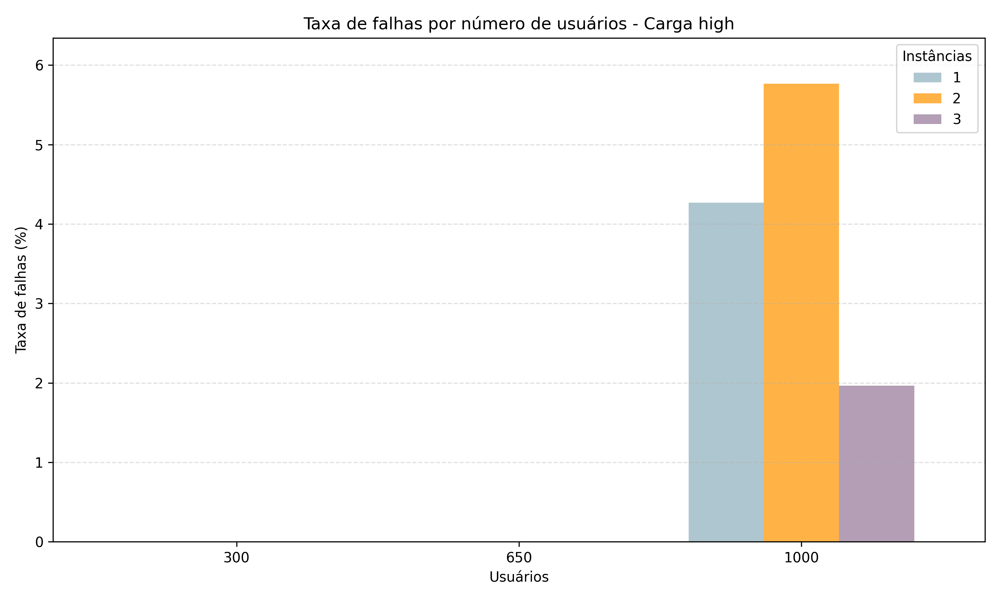</td>
</tr>
</table>

Imagens ~2 MB saturam banda e tempo de serviço; o P95 permanece alto frente ao `low`. O ponto crítico aparece com **1000 usuários**, onde surgem **falhas** — o gráfico de taxa de falhas deixa explícito qual configuração de instâncias tolera melhor o pico. Nos dados agregados (`clean_results.csv`), com três instâncias o número absoluto de falhas em 1000 usuários é menor que com uma ou duas, sugerindo que o paralelismo atrás do Nginx ajuda a absorver o pico (ainda com latência elevada).

---

### Carga híbrida (`hybrid`)

<table>
<tr>
<td align="center"><strong>Tempo de resposta (P95)</strong></td>
<td align="center"><strong>Taxa de falhas (%)</strong></td>
</tr>
<tr>
<td>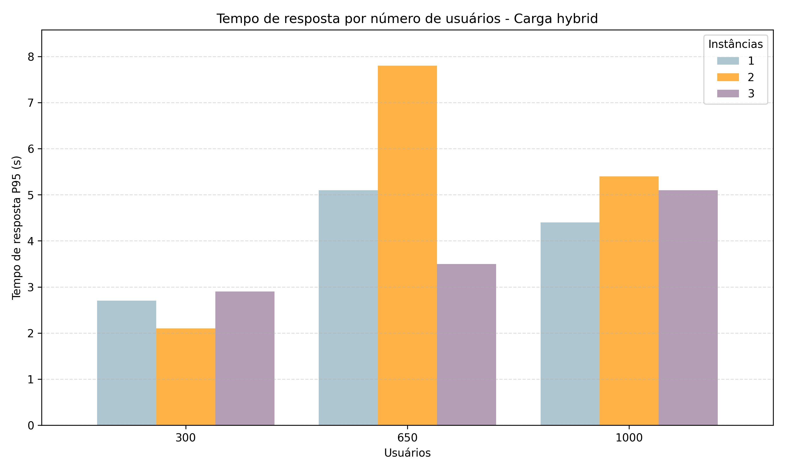</td>
<td>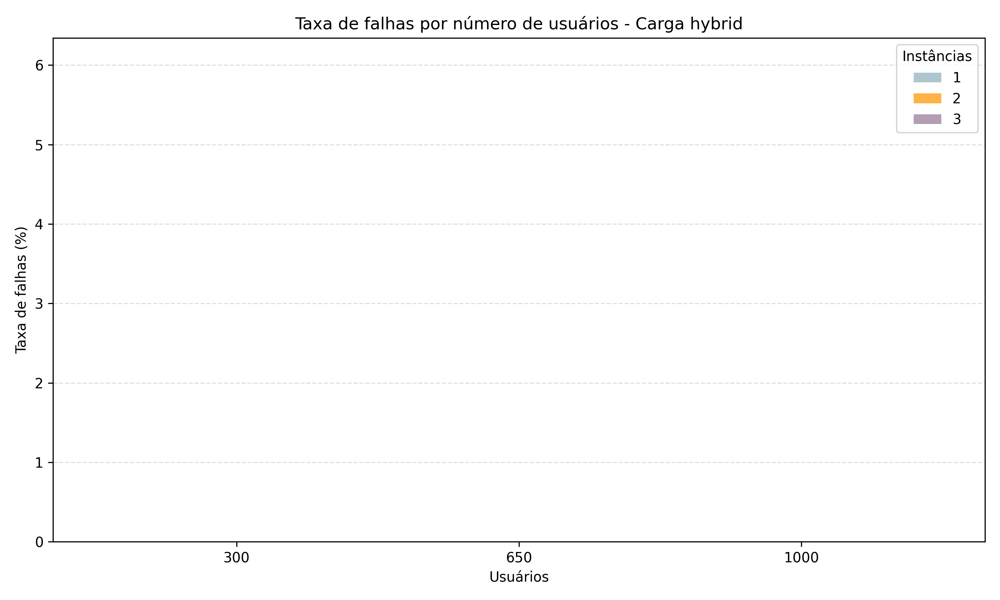</td>
</tr>
</table>

Misturar os três tipos de recurso por requisição reproduz um perfil mais “realista”. As falhas permanecem nulas no conjunto limpo, mas o **P95** pode oscilar mais entre combinações de usuários e instâncias do que no `low` — há trechos onde uma configuração intermediária de instâncias não é a melhor (por exemplo, picos em determinado par usuários/instâncias), o que reforça que dimensionamento ótimo depende do mix de tráfego e não só do número de réplicas.

---

## Por número de instâncias (Estilos 3 e 4)

Aqui o eixo de barras compara os **quatro cenários de carga** para uma mesma quantidade de **instâncias WordPress** (1, 2 ou 3).

### 1 instância

<table>
<tr>
<td align="center"><strong>Tempo de resposta (P95)</strong></td>
<td align="center"><strong>Taxa de falhas (%)</strong></td>
</tr>
<tr>
<td>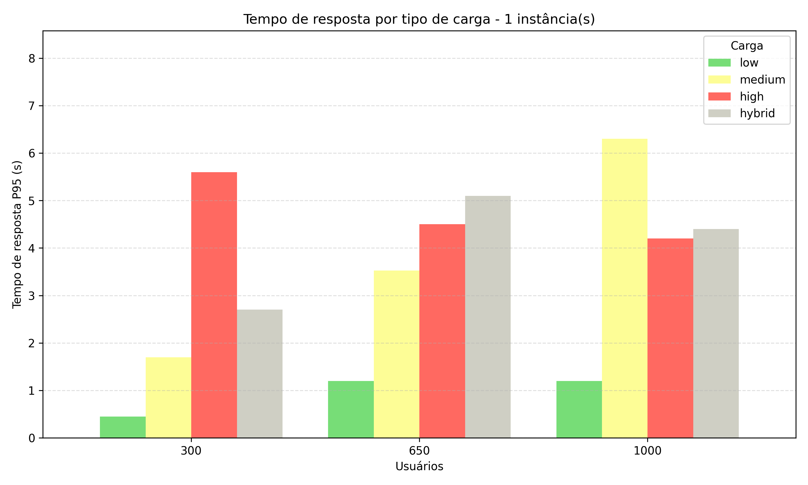</td>
<td>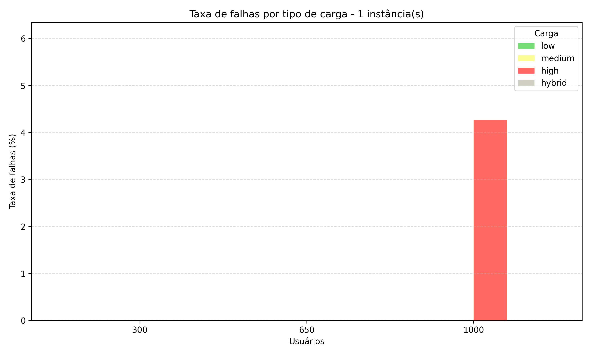</td>
</tr>
</table>

Com uma única réplica, a tendência é latência crescente de `low` para `medium` e `high`; `hybrid` situa-se entre eles conforme o mix. Sob pressão (`high`, 1000 usuários), falhas aparecem onde um único nó não acompanha o débito.

---

### 2 instâncias

<table>
<tr>
<td align="center"><strong>Tempo de resposta (P95)</strong></td>
<td align="center"><strong>Taxa de falhas (%)</strong></td>
</tr>
<tr>
<td>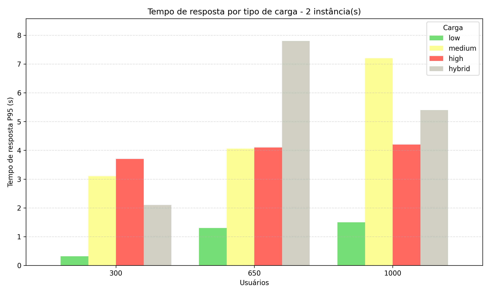</td>
<td>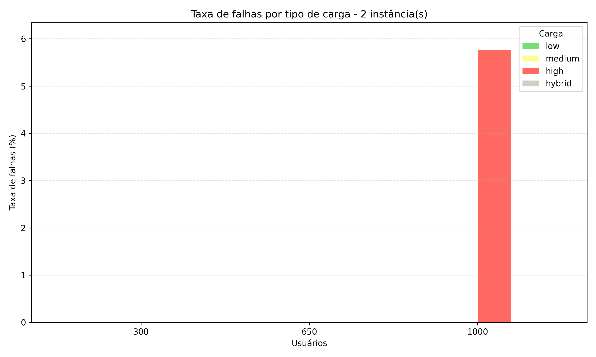</td>
</tr>
</table>

O balanceamento entre duas réplicas melhora vários pontos em relação a uma só, mas anomalias pontuais (por exemplo certos pares carga/usuários no `hybrid`) mostram que dois backends ainda podem encontrar gargalos compartilhados (armazenamento, PHP-FPM, rede).

---

### 3 instâncias

<table>
<tr>
<td align="center"><strong>Tempo de resposta (P95)</strong></td>
<td align="center"><strong>Taxa de falhas (%)</strong></td>
</tr>
<tr>
<td>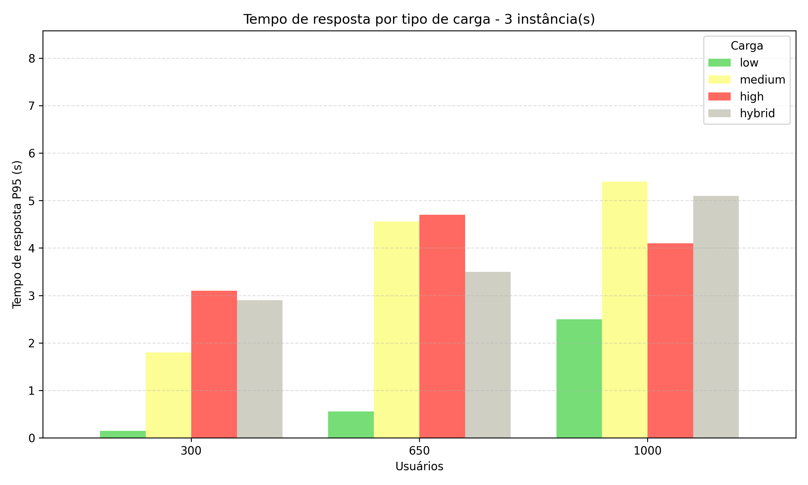</td>
<td>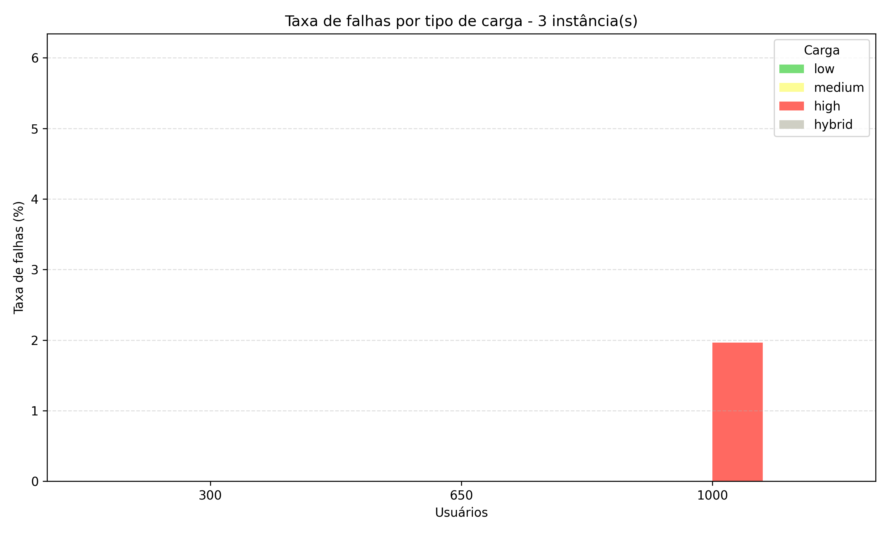</td>
</tr>
</table>

Três instâncias costumam oferecer o melhor compromisso nos picos de `high` (menos falhas e P95 mais controlado em vários pontos). Para cargas leves, o ganho marginal pode ser pequeno ou inconsistente — há overhead de coordenação e o sistema já não era o limitante.

---

## Arquivos `stats.csv`

Cada link aponta para o relatório agregado do Locust da execução correspondente (`Type`, `Name`, contadores, percentis, etc.).

### `high` (imagem ~2 MB)

| Usuários | inst1 | inst2 | inst3 |
|:---:|:---:|:---:|:---:|
| 300 | [stats.csv](results/high_300_inst1_stats.csv) | [stats.csv](results/high_300_inst2_stats.csv) | [stats.csv](results/high_300_inst3_stats.csv) |
| 650 | [stats.csv](results/high_650_inst1_stats.csv) | [stats.csv](results/high_650_inst2_stats.csv) | [stats.csv](results/high_650_inst3_stats.csv) |
| 1000 | [stats.csv](results/high_1000_inst1_stats.csv) | [stats.csv](results/high_1000_inst2_stats.csv) | [stats.csv](results/high_1000_inst3_stats.csv) |

### `hybrid`

| Usuários | inst1 | inst2 | inst3 |
|:---:|:---:|:---:|:---:|
| 300 | [stats.csv](results/hybrid_300_inst1_stats.csv) | [stats.csv](results/hybrid_300_inst2_stats.csv) | [stats.csv](results/hybrid_300_inst3_stats.csv) |
| 650 | [stats.csv](results/hybrid_650_inst1_stats.csv) | [stats.csv](results/hybrid_650_inst2_stats.csv) | [stats.csv](results/hybrid_650_inst3_stats.csv) |
| 1000 | [stats.csv](results/hybrid_1000_inst1_stats.csv) | [stats.csv](results/hybrid_1000_inst2_stats.csv) | [stats.csv](results/hybrid_1000_inst3_stats.csv) |

### `low` (imagem ~300 KB)

| Usuários | inst1 | inst2 | inst3 |
|:---:|:---:|:---:|:---:|
| 300 | [stats.csv](results/low_300_inst1_stats.csv) | [stats.csv](results/low_300_inst2_stats.csv) | [stats.csv](results/low_300_inst3_stats.csv) |
| 650 | [stats.csv](results/low_650_inst1_stats.csv) | [stats.csv](results/low_650_inst2_stats.csv) | [stats.csv](results/low_650_inst3_stats.csv) |
| 1000 | [stats.csv](results/low_1000_inst1_stats.csv) | [stats.csv](results/low_1000_inst2_stats.csv) | [stats.csv](results/low_1000_inst3_stats.csv) |

### `medium`

| Usuários | inst1 | inst2 | inst3 |
|:---:|:---:|:---:|:---:|
| 300 | [stats.csv](results/medium_300_inst1_stats.csv) | [stats.csv](results/medium_300_inst2_stats.csv) | [stats.csv](results/medium_300_inst3_stats.csv) |
| 650 | [stats.csv](results/medium_650_inst1_stats.csv) | [stats.csv](results/medium_650_inst2_stats.csv) | [stats.csv](results/medium_650_inst3_stats.csv) |
| 1000 | [stats.csv](results/medium_1000_inst1_stats.csv) | [stats.csv](results/medium_1000_inst2_stats.csv) | [stats.csv](results/medium_1000_inst3_stats.csv) |

---

*Gráficos produzidos por [`generate_graphs.py`](generate_graphs.py); dados tabulares resumidos em [`clean_results.csv`](clean_results.csv).*
