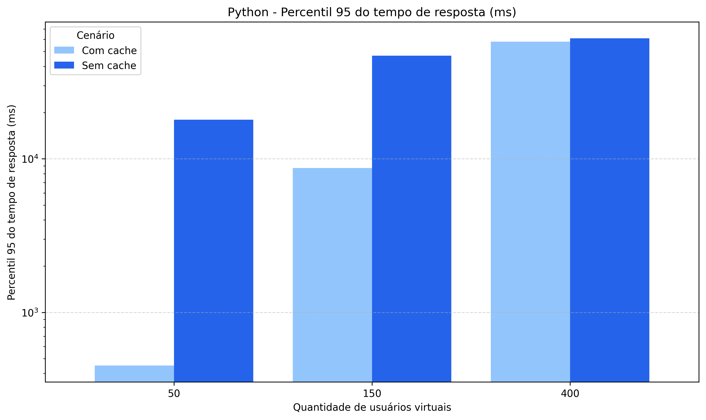
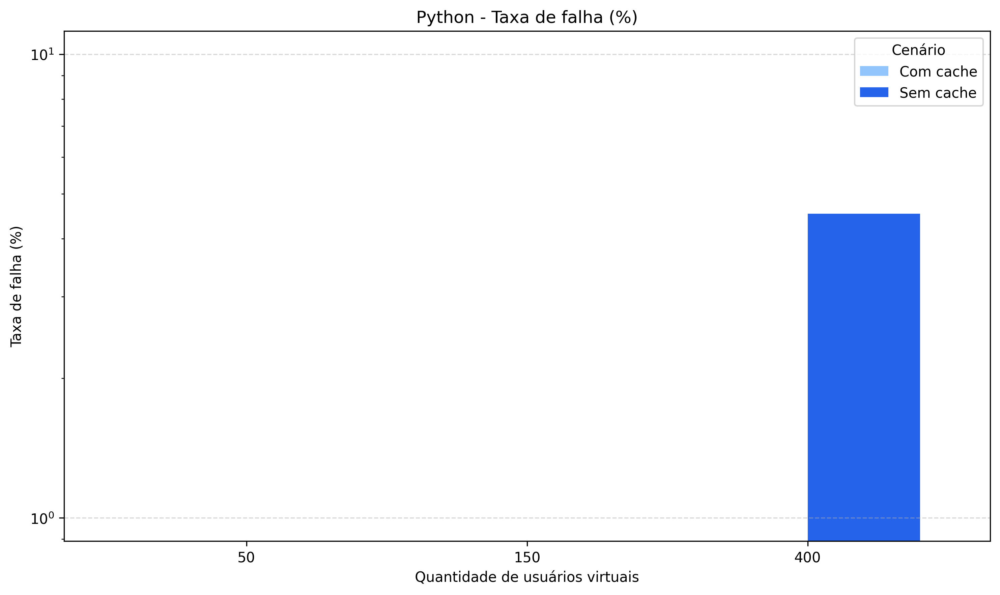
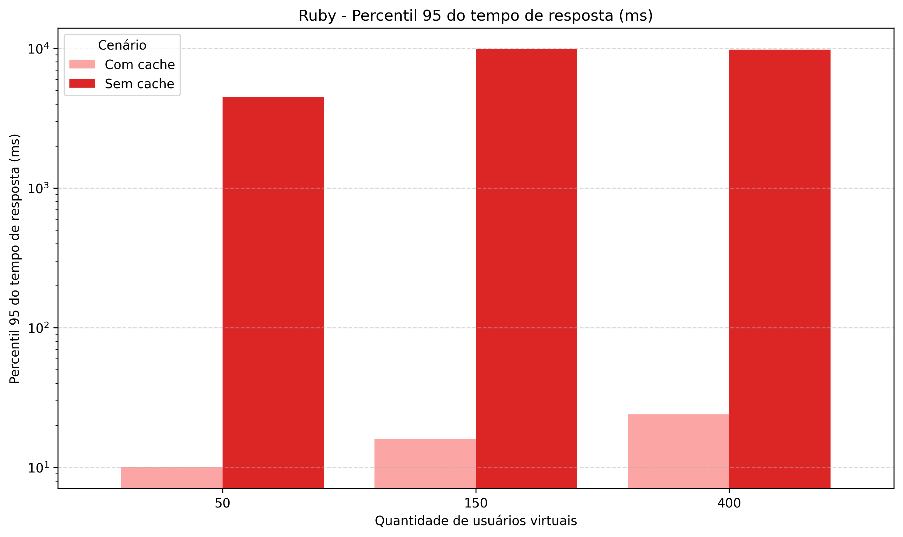
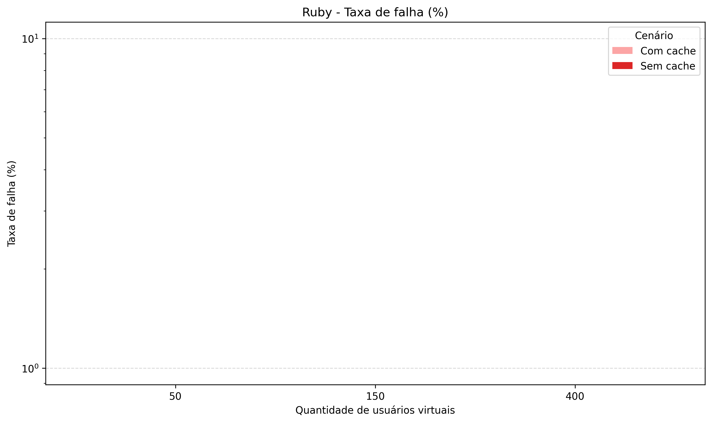

# Integrantes

- Eduardo Célio Freire Lopes - 2120351
- Luiz Roberto Chaves De Tillio - 2418598
- Sara Pessoa Silva - 2120371

# Análise dos testes de carga (Trabalho 4)

Este documento organiza os resultados gerados em [`results/graphs/`](results/graphs/) a partir de [`results/processed/final_results.csv`](results/processed/final_results.csv): para cada combinação de cenário e número de usuários, o **tempo de resposta (P95)** aparece ao lado da **taxa de falhas**.

## Contexto experimental

| Dimensão | Valores |
|----------|---------|
| **APIs testadas** | **Python** — Flask + BeautifulSoup4; **Ruby** — Sinatra + Nokogiri |
| **Modo de cache** | **Sem cache** — extração direta a cada requisição; **Com cache** — resultados armazenados no Redis |
| **Usuários simultâneos** | 50, 150 e 400 |
| **URLs testadas** | 10 sites reais percorridos em round-robin por cada usuário virtual (`urls.txt`) |
| **Métricas nos gráficos** | P95 em milissegundos (escala logarítmica); taxa de falhas = `failures / requests × 100` |

Os detalhes brutos por execução estão nos arquivos `results/raw/<cenário>_<usuários>_stats.csv` (links na [seção final](#arquivos-statscsv)).

---

## Por linguagem

Cada bloco compara a versão **sem cache** com a versão **com cache** para o mesmo idioma, mostrando o impacto do Redis sobre a latência e a confiabilidade.

### Python

<table>
<tr>
<td align="center"><strong>Tempo de resposta (P95)</strong></td>
<td align="center"><strong>Taxa de falhas (%)</strong></td>
</tr>
<tr>
<td></td>
<td></td>
</tr>
</table>

Sem cache, o Python (Flask + BeautifulSoup4) precisa buscar e processar cada URL a cada requisição, o que eleva o P95 rapidamente: de ~18 s com 50 usuários para ~61 s com 400. A taxa de falhas zera em cargas baixas, mas aparece a partir de 400 usuários (≈ 4,5%), indicando que o tempo de serviço supera o timeout ou a capacidade do servidor. Com o Redis habilitado, o primeiro acesso ainda é custoso, mas todas as chamadas subsequentes retornam do cache em milissegundos — o P95 cai para ~450 ms com 50 usuários e as falhas somem por completo em todos os patamares.

---

### Ruby

<table>
<tr>
<td align="center"><strong>Tempo de resposta (P95)</strong></td>
<td align="center"><strong>Taxa de falhas (%)</strong></td>
</tr>
<tr>
<td></td>
<td></td>
</tr>
</table>

A implementação Ruby (Sinatra + Nokogiri) tem desempenho notavelmente melhor sem cache do que a Python: P95 de ~4,5 s com 50 usuários estabilizando em ~9,8–9,9 s com 150 e 400, e **zero falhas** em todos os níveis de carga. O ganho com cache é ainda mais pronunciado: P95 cai para 10–24 ms, o que representa latências próximas ao mínimo possível em rede local. O throughput cresce de ~21,6 req/s sem cache para ~48,7 req/s com cache a 400 usuários.

---

## Comparativo geral

| Cenário | Usuários | Requisições | Falhas | Taxa de falhas | Média (ms) | P95 (ms) | req/s |
|---------|:--------:|:-----------:|:------:|:--------------:|:----------:|:--------:|:-----:|
| Python — sem cache | 50 | 473 | 0 | 0 % | 8 755 | 18 000 | 5,30 |
| Python — sem cache | 150 | 447 | 0 | 0 % | 25 238 | 47 000 | 5,00 |
| Python — sem cache | 400 | 464 | 21 | **4,53 %** | 35 484 | 61 000 | 5,20 |
| Python — com cache | 50 | 2 049 | 0 | 0 % | 204 | 450 | 23,08 |
| Python — com cache | 150 | 4 141 | 0 | 0 % | 1 279 | 8 700 | 46,27 |
| Python — com cache | 400 | 4 953 | 0 | 0 % | 5 299 | 58 000 | 55,39 |
| Ruby — sem cache | 50 | 1 935 | 0 | 0 % | 2 273 | 4 500 | 21,64 |
| Ruby — sem cache | 150 | 1 806 | 0 | 0 % | 4 775 | 9 900 | 20,20 |
| Ruby — sem cache | 400 | 1 818 | 0 | 0 % | 4 747 | 9 800 | 20,34 |
| Ruby — com cache | 50 | 2 264 | 0 | 0 % | 37 | 10 | 25,24 |
| Ruby — com cache | 150 | 4 352 | 0 | 0 % | 84 | 16 | 48,54 |
| Ruby — com cache | 400 | 4 371 | 0 | 0 % | 79 | 24 | 48,71 |

### Principais conclusões

**Cache elimina falhas e reduz latência em uma ou duas ordens de grandeza.** Python sem cache chega a 35 s de média e 4,5 % de falhas com 400 usuários; com cache a média despenca para 5,3 s (≈ 85 % de melhora) e as falhas somem. Ruby sem cache já parte de um patamar mais baixo (2,3 s), mas com cache o ganho relativo é ainda maior: médias de 37–84 ms independentemente da carga.

**Ruby supera Python em todos os cenários.** Sem cache, o Ruby é aproximadamente **74 % mais rápido** a 50 usuários e não produz falhas nem a 400 usuários, ao contrário do Python. Com cache, o Ruby também leva vantagem — P95 de 10–24 ms frente a 450–58 000 ms do Python —, o que sugere que o Nokogiri (C-extension) processa o HTML inicial (ao popular o cache) de forma mais eficiente que o BeautifulSoup4 puro-Python.

**A estabilização do Ruby sem cache** entre 150 e 400 usuários (P95 praticamente igual, sem aumento de falhas) indica que a fila de espera cresce, mas o servidor Sinatra/WEBrick absorve a demanda extra sem travar — o gargalo está na latência das URLs externas, não no processo Ruby.

---

## Arquivos `stats.csv`

Cada link aponta para o relatório agregado do Locust da execução correspondente (`Type`, `Name`, contadores, percentis, throughput, etc.).

### Python — sem cache

| Usuários | stats |
|:---:|:---:|
| 50 | [stats.csv](results/raw/python_50_stats.csv) |
| 150 | [stats.csv](results/raw/python_150_stats.csv) |
| 400 | [stats.csv](results/raw/python_400_stats.csv) |

### Python — com cache

| Usuários | stats |
|:---:|:---:|
| 50 | [stats.csv](results/raw/python-cache_50_stats.csv) |
| 150 | [stats.csv](results/raw/python-cache_150_stats.csv) |
| 400 | [stats.csv](results/raw/python-cache_400_stats.csv) |

### Ruby — sem cache

| Usuários | stats |
|:---:|:---:|
| 50 | [stats.csv](results/raw/ruby_50_stats.csv) |
| 150 | [stats.csv](results/raw/ruby_150_stats.csv) |
| 400 | [stats.csv](results/raw/ruby_400_stats.csv) |

### Ruby — com cache

| Usuários | stats |
|:---:|:---:|
| 50 | [stats.csv](results/raw/ruby-cache_50_stats.csv) |
| 150 | [stats.csv](results/raw/ruby-cache_150_stats.csv) |
| 400 | [stats.csv](results/raw/ruby-cache_400_stats.csv) |

---

*Resultados processados por [`analysis/process_results.py`](analysis/process_results.py); gráficos gerados por [`analysis/generate_graphs.py`](analysis/generate_graphs.py); testes executados via [`run_tests.py`](run_tests.py) com infra orquestrada pelo [`docker-compose.yml`](docker-compose.yml).*
